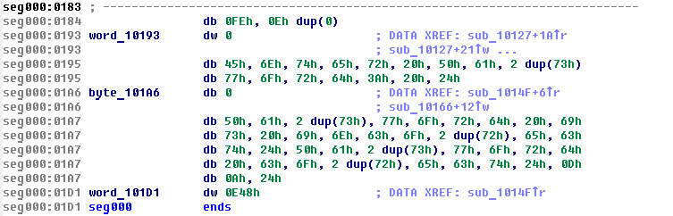
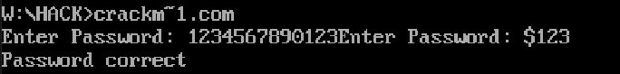
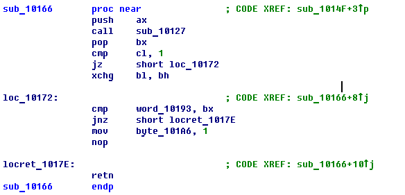
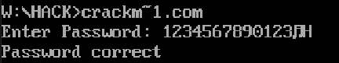
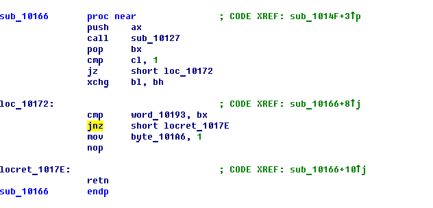
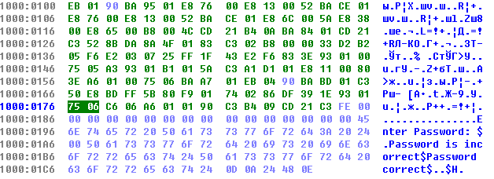
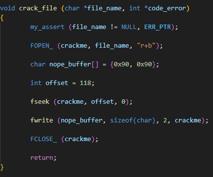
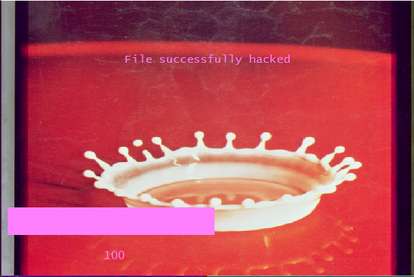

# :muscle: Crack :muscle:

Данный проект содержит в себе программу, проверяющую пароль, и взлом данной программы, написанной моим напарником.

***

## Взлом

Для взлома я использовал три программы:

        1. TurboDebugger
        2. IDA (интерактивный дизассемблер)
        3. Программа на языке Cи

### Ход работы

#### 1. Взлом при помощи переполнения буфера.

Сначала я дизассемблировал файл оппонента при помощи ```IDA``` и тщательно изучил все его функции. Мною были найдены две уязвимости, проявляющиеся при переполнении буфера. Рассмотрим их по отдельности.

***

###### Первая уязвимость через буфер.

Я заметил, что флаг, отвечающий за верность пароля, лежит в сегменте данных после буфера, куда программа пишет пароль. Изначально данный флаг равен ```0```, поэтому мы можем перезаписать его просто переполнив буфер. 



Для этого введем ```13``` любых символом, чтобы заполнить буфер, и еще ```20``` символов, чтобы дойти до флага и перезаписать его. Тогда значение флага изначально будет равно 1. Программа никак его не изменит и выдаст нам доступ.



***

###### Вторая уязвимость через буфер.

Вторая уязвимость при переполнении буфера заключается в том, что после буфера выделены два байта, для хранения в них хэш-код пароля. Также в памяти приведен хэш-код верного пароля - ```0E48```.


Заметим, что в функции хэширования, если буфер был переполнен, то выполняется команда ```xchg bl, bh```, причем в регистре ```bx``` хранится хэш-код верного пароля. Это говорит нам о том, что вводимые нами символы должны идти в обратном порядке.



Значит нам необходимо ввести ```13``` символов, чтобы заполнить буфер и два символа с ASCII кодом ```48``` и ```0E```.



***

#### 2. Взлом при помощи бинарного патча.

При просмотре программы был замечен условный jump ```jnz```, сразу после которого стоит выставление флага в ```1```. Поэтому мы можем изменить бинарный код данной команды на код команды ```nop```. Чтобы узнать какие байты необходимо изменить, воспользуемся IDA.





При помощи программы ,написанной на языке си, мы заменяем ```jnz``` на два ```nop```.
Таким образом данная строка будет просто занимать место в памяти, и всегда будет выполняться команда ```mov 'flag', 1```. Ниже приведен код, который перезаписывает команду.



Во время использования данной программы вы наткнетесь на графическое окно, реализованное при помощи библиотеки TXLib.



## Установка программы

### При помощи этой команды(её нужно вводить в командной строке) скачай все файлы в один свой файл.

    git clone https://github.com/EntryFrager/HACK.git
